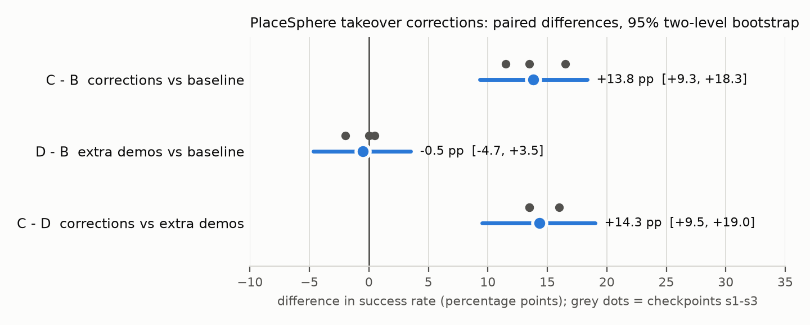
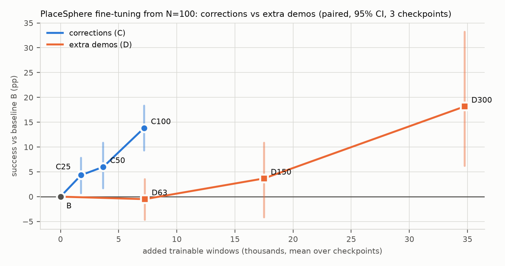

# PlaceSphere 专家中途接管：可行性 probe（预先写定）

2026-10-04。接续[交接文档](failure-aware-handoff.zh-CN.md)和[源码核对与接管点定义](failure-expert-takeover.zh-CN.md)。本节的设计、种子和门槛在**任何 probe 运行之前**写定于 `configs/failure_aware/takeover_probe.toml`；运行结果写在文末，不回改上面的规则。

## 1. 要回答的问题

只回答"专家能否从 baseline 自己到达的稳定持球中途状态把球放好，分叉是否严格对齐"。不回答"纠正训练是否有效"，那需要后续独立种子评估和同预算普通示范对照。

## 2. 实现与设计决定

| 项 | 决定 | 理由 |
| --- | --- | --- |
| 专家形式 | 自写闭环脚本控制器 `TransportPlaceExpert`（`dp_manip/takeover.py`），直接输出 4 维 `pd_ee_delta_pos` 归一化动作 | 持球后的运输/下放/释放只有桌面和浅 bin 两个障碍，不需要 RRT/screw 规划；直接在策略的动作空间输出，**没有 joint→ee 转换和额外 step**，每个专家动作恰好是一个真实环境步 |
| 读取的状态 | 每步读 TCP、球位置/速度、bin 位置、`is_obj_grasped`（仿真特权状态） | 采集用 oracle；策略训练和评估仍只用 RGB+proprio |
| 阶段 | transport（先升到安全高度再水平移到 bin 正上方，球心在 bin 静置高度 +3cm）→ descend（降到静置高度 +1.5cm，水平持续校正）→ release（张开 6 步）→ retract（张开状态上抬 5cm）→ hold | 不重新抓取；夹爪从接管第一步起保持闭合命令（-1），避免交接时松球 |
| 动作幅度 | 每轴每步 ≤ 2cm（归一化 0.2），在专家示范动作 p95（0.17–0.19）附近 | 不让专家使用示范中不存在的大动作 |
| 安全 | TCP 目标高度不低于 bin_z+2.5cm（手指不撞 bin 壁）；连续 3 步未抓住记为 `lost_grasp` 并停止 | 掉球后不重抓，如实记失败 |
| 超时 | transport 60 步、descend 30 步、retract 20 步，超时记事件后进入下一阶段 | 不无限等待；所有超时计入报告 |

**分叉方式**：B 是 baseline 原回合本身（单环境、每回合独立的 CUDA generator，种子=inference_seed+reset seed）。E 在新环境 `reset(seed)` 后**原样重放 B 的前 τ 个动作**，核对 S_τ 的完整仿真状态向量（`env.get_state()`）、0..τ 全部 RGB 和 proprio、逐步抓取/放置/静止/成功标志与 B **逐位相等**，然后交给专家执行剩余 `200−τ` 步。没有暖机步，没有 `set_state`。另外再重放一次前缀，用 B 在 τ 处保存的 generator 状态和真实两帧观测历史继续 baseline，核对动作逐位相同且结果相同（"B 从分叉点可复现"）。pd_ee_delta_pos 不使用 target 模式，控制器无内部状态，因此重放即完整恢复控制器。

## 3. 触发规则（与设计文档一致）

动作块边界 t（已执行 t 个动作，下一块采样前），t%8=0、16≤t≤120，且对 S_{t−15}..S_t：

1. 全部 `is_obj_grasped`；
2. 球心全部高于本回合初始球心 ≥3cm；
3. 球相对 TCP 的向量与 S_t 时相比最大偏差 ≤1cm（无明显滑移）；
4. S_1..S_t 从未成功；S_t 不在 bin 上。

取最早满足的 t 为 τ。判定只读 t 及以前的状态，不看结果。未触发的回合按顺序记原因：`success_before_trigger` / `never_grasped` / `grasp_not_stable` / `not_lifted` / `slip` / `late`（120 之后才满足）。

## 4. 种子

- 开发 `40900–40919`：只用于调试实现和专家；**不进入 probe 判定**，开发期间可改专家/实现，每版换输出目录。
- probe `40000–40029`：专家冻结后只跑一次，全部 30 个种子都进入报告。
- 与已用种子（示范 0 起/val 4000 起、test 10000–10099、第一轮 20000–22999、第二轮 32000–34127）无交集，测试 `tests/test_takeover.py` 检查。

## 5. 通过门槛（全部满足才推进纠正采集）

对 probe 中所有触发起点：

| 门槛 | 值 |
| --- | --- |
| 重放对齐（状态向量、RGB、proprio、任务标志逐位相等） | 100% |
| B 从分叉点重放复现（动作逐位相同且结果相同） | 100% |
| 触发且 baseline 失败的起点数 | ≥ 6 / 30 |
| 专家成功率（全部触发起点为分母，含掉球/超时） | ≥ 80% |
| 专家在 baseline 失败起点上的成功率 | ≥ 75% |
| 专家真实步数 = 200−τ | 全部 |

覆盖不足或专家不达标时，先报告并在开发种子上改版，改版后的 probe 用**新的** probe 区间重跑，不在同一 probe 区间上反复试。

## 6. 通过后的下一步（概要，采集前另行写定）

1. 纠正采集：三个 baseline checkpoint，新采集种子区间；记录每个触发起点（不论 B 成败）的 E 分支，正向数据只取专家成功的尾段（τ−1、τ 两帧真实历史 + 专家动作至 retract 结束），同时报告全部尝试的恢复率和剔除原因。
2. 对照：B（不微调）、D（同等转移数的普通专家示范微调，示范来自既有未用于 N=100 训练的示范）、C（专家纠正片段微调），微调都混入原 100 条示范防遗忘，步数/学习率相同。
3. 评估：新的独立种子，三个 checkpoint，配对比较；先只做正向 BC，不假设负向/偏好训练有益。

## 7. 结果（2026-10-04）

产物：集群 `/userhome/cs5/u3684139/dp-runs-placesphere-takeover/{dev_v1,probe_v1}/`（每种子 `records/*.json`、`episodes/*.npz` 含逐步特权状态和两分支 RGB、`videos/` 左B右E并排视频；probe 的 `decision.json` 为 write-once）。本地副本：`results/takeover-probe-v1/`（视频与记录，gitignore）。代码 hash 见 `identity.json`（takeover.py `775e67e7…`，runner `6fd11e2d…`，config `c295c36e…`）。

**开发（Job 136055，40900–40909，不入判定）**：10 个种子中 5 个触发，专家 5/5 成功，重放/B 复现全部逐位一致；但 5 个触发全部是 baseline 本来就成功的回合，5 个 baseline 失败全是抓取阶段失败（3 个从未抓住、2 个抓取不稳）。专家未作任何修改即冻结。

**probe（Job 136056，40000–40029，约 7 分钟墙钟）**：`passed=false`，唯一未过的是覆盖门槛。

| 指标 | 结果 | 门槛 |
| --- | --- | --- |
| baseline 成功 | 6/30 | — |
| 触发起点 | 9（baseline 成功 6、失败 3） | — |
| 未触发原因 | grasp_not_stable 12、never_grasped 9 | — |
| 重放对齐（状态向量/RGB/proprio/任务标志逐位相等） | 9/9 | 100% ✓ |
| B 从分叉点复现（动作逐位、结果相同） | 9/9 | 100% ✓ |
| 触发且 baseline 失败 | **3** | ≥6 ✗ |
| 专家成功（全部触发起点） | 9/9 | ≥80% ✓ |
| 专家成功（baseline 失败起点） | 3/3（40002、40019、40021 被救回） | ≥75% ✓ |
| 专家真实步数 = 200−τ | 9/9 | ✓ |

τ 为 64–112。专家虽 9/9 成功，但只有 5/9 走完正常路径：3 个 descend 未在 30 步内满足容差而超时释放（40002、40019、40026），1 个 descend 中球滑出（40021，`lost_grasp`）后落入 bin 而成功。成功率不能被读成"每一步都可控"；若后续使用该专家，descend 的收敛条件需在开发种子上改进。视频核对：40019 B 最终球停在 bin 旁，40021 B 运输中掉球，E 均放入 bin。

**大样本覆盖核对（第一轮 s1 `raw_train.h5`，488 回合，种子 20000+，属采集种子）**：proprio 第18列为 is_grasped、19–21 为 TCP 位置；用"连续16步抓住且 TCP 高度≥5cm"近似触发规则（无球位姿，故为近似）。338 个失败中：从未抓住 167（49%）、抓取不连续 138（41%）、抓稳未抬起 4、满足触发 29（**8.6%**）；150 个成功中 147 满足触发。抓取不连续的 171 个"曾抓住"失败里，131 个最长连续抓取 ≤3 步，属于擦碰而非标志抖动；167 个从未抓住的失败全部发出了闭合命令、手指完全合拢、TCP 降到约 2cm，即**在球高度闭合但没抓到**。

### 判读

- 实现层面可行：不 reset 的同前缀分叉逐位对齐，B 可从分叉点复现，4 维专家在持球起点上 12/12（开发 5 + probe 9）放置成功，预算内完成。
- 研究层面不通过：持球后接管只覆盖约 9% 的 baseline 失败；约 90% 的失败发生在抓取阶段（闭合落空或擦碰）。按预定规则**不推进纠正采集/训练**。即使该部分完全学会，成功率上限也只约 +6pp（0.09×失败率），难以在现有样本量下检出。

### 建议的 v2（需另行写定后在新的开发/probe 区间上验证）

接管点前移到抓取失误：在动作块边界检测"夹爪已闭合（命令<0 且手指间距小于球径）但 `is_obj_grasped` 为假、球仍在桌面"的最早时刻（落空后数步内即可客观判定的 oracle 触发），专家张开、上抬、重新对准球顶下降、闭合、抬起，再接现有的运输/放置控制器。它针对约 90% 的失败，更接近真实失误点；同样需要报告覆盖率、对齐、恢复率，并单独记录 baseline 在同一起点自行重抓成功的比例（这些起点并不都是必然失败）。

## 8. v2：抓取落空接管（2026-10-05 写定，运行前）

配置 `configs/failure_aware/takeover_probe_v2.toml`；开发 40920–40949，probe 40100–40129（与 v1 及所有既有区间无交集）。

- **触发**（oracle，只读 t 及以前）：动作块边界 t≤96，最近 4 个状态手指间距 <2cm（持球时中位 3.5cm、1% 分位 2.7cm），最近 8 个状态未抓住，球心仍在初始高度 1cm 内，且从未成功。第一轮 s1 的 488 回合近似估计：338 个失败中 304 个（90%）在 t≤96 触发，150 个成功只有 3 个触发；中位 τ=56。
- **专家** `RegraspExpert`：张开并上抬到球心上方 6cm → 对准 → 下降到球心高度 → 闭合，连续 3 步抓住后交给 v1 的运输/放置控制器；没抓住则重试一次，再失败记 `grasp_failed`。每轴每步 ≤2cm。
- **开发期改动**（均在 probe 前、只用开发种子）：(1) 放置的 settled 判定改为相邻两状态球位移 <1mm（v1 中持球静止时读到的球速一直为 0.06–0.18 m/s，导致 descend 超时）；(2) 开发批 a（40920–40929）有 2/6 次因被碰飞的球以 0.1–0.2 m/s 滚走而失败，加入"速度前瞻"（瞄准球速×min(距离/0.15, 0.5s) 之后的位置）和"上抬过 3cm 后即可横移"。
- **开发结果**（Job 136062，30 种子）：19 个触发全部是 baseline 失败；专家 16/19 成功；重放与 B 复现全部逐位一致。3 个失败都是球滚出手臂可达范围（40921 滚向基座内侧可达极限、40924 滚到 y=−0.69、40948 卡在 x≈0.15 工作空间边界），属于该专家无法恢复的状态，不再针对它们调参，专家冻结（takeover.py `2ae4aa0a…`、config `86b0f2fb…`）。
- **门槛**：重放/B 复现 100%；触发且 baseline 失败 ≥12/30；专家成功率（全部触发起点、所有尝试计入分母）≥70%，在 baseline 失败起点上 ≥70%。

## 9. 纠正训练（probe v2 通过后执行，2026-10-05 写定，采集前）

配置 `configs/failure_aware/takeover_correction.toml`，入口 `scripts/takeover_correction.py`（collect / build / finetune / evaluate / analyze）。

- **采集**：s1–s3 各自的 baseline，种子 41000–41599 依序运行，直到 100 个专家成功纠正；所有尝试（未触发、专家失败、原因）都有记录。每次接管都重新核对前缀重放逐位一致，不一致即停止。
- **纠正片段**：专家分支从 τ−1 到首次成功所在动作块末尾；τ−1、τ 两帧是真实历史，`train_start=1` 使训练窗口只从 τ 开始，接管前 baseline 状态不作为决策样本。唯一残留的接管前动作是 τ−1 实际执行的动作，只占第一个窗口的"过去"槽位（推理时不执行）。
- **三组**（每个 checkpoint）：B 不微调；C = 原 100 条示范 + 纠正片段；D = 原 100 条示范 + 按种子顺序接下来的专家示范，直到可训练窗口数不少于 C 的纠正窗口数（同预算普通示范对照）。C、D 设置完全相同：从 baseline final.pt 开始、全部参数可训练、沿用 baseline 归一化、lr 3e-5 常数（500 步 warmup）、10000 步、batch 64、EMA 0.9999。
- **评估**：新种子 43000–43199，每个 checkpoint 每组 200 回合，horizon 200，num_envs 与推理种子沿用 baseline 记录。
- **判定**：两层配对 bootstrap（先抽 checkpoint 再抽种子，10000 次）。C−B 95% 区间高于 0 才说"纠正训练提升"；同时 C−D 区间高于 0 才说"超出同量普通示范的效果"；否则报告点估计与区间、不可区分。只做正向 BC，不加负向/偏好项。

## 10. 结果（2026-10-05，v2 probe 与纠正训练）

### 10.1 v2 probe（Job 136066，40100–40129，冻结专家只跑一次）

`passed=true`：30 个种子中 baseline 失败 18 个，其中 16 个在抓取落空时触发（89%）；12 个 baseline 成功回合无一触发。重放对齐 16/16，B 从分叉点复现 16/16；专家 12/16 成功（75%，含所有尝试；失败中 3 个为两次重抓都没抓住）。真实步数均等于 200−τ。

### 10.2 纠正数据采集（Job 136068 + 流水线 136073）

| checkpoint | 种子数 | baseline 成功 | 触发（其中 baseline 失败） | 专家成功 = 纠正片段 | 纠正窗口 | D 额外示范 / 窗口 |
| --- | ---: | ---: | --- | ---: | ---: | --- |
| s1 | 226 | 83 | 129（128） | 100 | 7136 | 63 / 7251 |
| s2 | 233 | 90 | 131（131） | 100 | 7248 | 63 / 7251 |
| s3 | 221 | 83 | 130（129） | 100 | 7176 | 63 / 7251 |

专家成功率 76–78%，与 probe 一致；每次接管都重新核对了前缀重放逐位一致。

### 10.3 评估（种子 43000–43199，每组 200 回合，horizon 200）

| checkpoint | B | C（+纠正） | D（+等量示范） |
| --- | ---: | ---: | ---: |
| s1 | 67 | 94 | 67 |
| s2 | 63 | 96 | 64 |
| s3 | 67 | 90 | 63 |
| 合计 / 600 | 197（32.8%） | 280（46.7%） | 194（32.3%） |

预定判定（两层配对 bootstrap，10000 次，`decision.json`）：

| 比较 | 差值 | 95% 区间 | 只有前者成功 / 只有后者成功 | 各 checkpoint（McNemar p） |
| --- | ---: | --- | --- | --- |
| C − B | **+13.8pp** | [+9.3, +18.3] | 115 / 32 | +13.5（1e-4）、+16.5（2e-6）、+11.5（0.002） |
| D − B | −0.5pp | [−4.7, +3.5] | 72 / 75 | 0.0（1）、+0.5（1）、−2.0（0.68） |
| C − D | **+14.3pp** | [+9.5, +19.0] | 148 / 62 | +13.5（7e-4）、+16.0（3e-4）、+13.5（0.002） |

**按预定措辞**：`corrections_help=true`、`beyond_extra_demos=true`。在 PlaceSphere、N=100 baseline、本微调设置下，用专家在抓取落空后的纠正片段微调，成功率提升 13.8pp；同量普通专家示范没有可测提升，纠正数据比同量示范高 14.3pp。三个 checkpoint 方向一致、各自显著。

### 10.4 判读与局限

- 与前两轮负向引导（F−B +1.7pp，区间含 0）对比：在策略自己失误的状态上给出正确示范有效，单纯利用失败数据推开策略无效。
- D 没有提升，可能是普通示范不覆盖策略实际进入的失误状态，也可能是本微调设置（1 万步、lr 3e-5）吃不进普通示范；需"汇率曲线"区分（§11）。
- **与从零训练的数据量曲线对照（N=400 补点，2026-10-05，Job 136088）**：PlaceSphere 从零训练 10 万步，test 成功率随示范数 25/50/100/200/400 为 4.7% / 25.3% / 36.0% / 76.6% / **96.2%**（N=400 五个种子 0.95–0.97，val 95.2%）。200→400 仍上升并接近饱和，没有过拟合，因此"纠正数据突破了更多示范的上限"不成立：C（46.7%）远低于从零训练的 N=200/400。两者训练方式不同（C 是 N=100 上微调 1 万步，额外约 7000 个窗口；N=200 是从头 10 万步、额外约 11600 个窗口的完整示范），不能直接比较。但反差本身值得注意：从零训练时更多普通示范涨得很多，而同样的示范以微调方式加入（D）完全不涨。这提示 D 的零提升更可能来自微调设置，而不是普通示范本身没用；纠正数据的优势应理解为"在这套微调设置下更有效"，其相对价值由 §11 的汇率曲线检验。
- 适用范围：单一任务、单一 baseline 水平（N=100）、只覆盖抓取落空、触发器与专家都用仿真特权状态；只有 3 个 checkpoint，checkpoint 间方差估计有限。
- 尚未验证机制（C 的评估回合中抓取落空是否减少）。

## 11. 机制验证与汇率曲线（2026-10-05 写定，运行前）

配置 `configs/failure_aware/takeover_curve.toml`，入口 `scripts/takeover_curve.py`，作业脚本 `slurm/takeover_curve_pipeline.sbatch`。只读取 §9–10 的产物，不改写它们。

- **机制验证**：用已有的 B/C/D 模型在同样的 43000–43199 种子上重跑评估，逐回合结果必须与 §10 记录完全一致，否则作业停止。同时只从本体观测（手指关节、is_grasped）计算：
  - 抓取落空：与 v2 触发相同，但去掉球高度检查，因为本体观测里没有球的位置；
  - 落空后是否成功；
  - "因落空而失败"率；
  - 失败阶段：没抓稳，或抓稳后失败。
  - 主问题 M1：C 相对 B 的"因落空而失败"率配对差，区间整体低于 0，才说纠正减少了落空导致的失败。
- **汇率曲线**：每个 checkpoint 新增 4 个点，微调设置与 §9 完全相同。
  - C25、C50：原 100 条示范 + 按种子顺序的前 25、50 个纠正片段；
  - D150、D300：原 100 条示范 + 接下来 150、300 条示范。D300 用完整个 400 条示范池。
  - 与已有的 B、C100、D63 组成两条"新增训练窗口 → 成功率"曲线，全部与 B 配对比较（两层 bootstrap）。
  - Q1：D300−B 区间高于 0，说明本微调设置能吸收普通示范；若 D150、D300 区间都含 0，说明这套微调设置吸收不了多达 +300 条示范，此时 C 对 D 的优势不能推广为"纠正数据比普通示范更好"。
  - Q2：纠正数据量的剂量关系。
  - Q3：两条曲线的描述性汇率。
- **磁盘**：新模型训练完成、确认 final.pt 存在后删除其 resume.pt。因磁盘约束（剩余约 8G），本轮不新采集纠正片段，暂不做 C200。

## 12. 结果：机制验证与汇率曲线（2026-10-06，Job 136133）

产物：集群 `~/dp-runs-placesphere-takeover/curve/`（`curve_decision.json` 为 write-once 判定）；本地副本 `results/takeover-curve/`。作业 22:00–04:03，开头 28 个单元测试通过；B/C/D 的 9 次重评估全部与 §10 记录逐回合一致。

### 12.1 汇率曲线（每组 3 个 checkpoint × 200 回合，与 B 配对）

| 组 | 新增可训练窗口（均值） | 成功 / 600（s1/s2/s3） | 成功率 | 相对 B | 95% 区间 |
| --- | ---: | --- | ---: | ---: | --- |
| B | 0 | 197（67/63/67） | 32.8% | — | — |
| C25 | 1.8k | 223（78/75/70） | 37.2% | +4.3pp | [+0.7, +7.8] |
| C50 | 3.7k | 233（77/83/73） | 38.8% | +6.0pp | [+1.7, +10.8] |
| C100 | 7.2k | 280（94/96/90） | 46.7% | +13.8pp | [+9.3, +18.3] |
| D63 | 7.3k | 194（67/64/63） | 32.3% | −0.5pp | [−4.7, +3.5] |
| D150 | 17.5k | 219（80/80/59） | 36.5% | +3.7pp | [−4.2, +10.8] |
| D300 | 34.7k | 306（93/131/82） | 51.0% | +18.2pp | [+6.2, +33.2] |

- **Q1（预定判定 `Q1_extra_demos_help=true`）**：D300−B 区间高于 0。这套微调设置能吸收普通示范，只是需要多得多的量：D63、D150 的区间都含 0，加满 300 条才明显提升。§10.4 中"D 的零提升可能来自微调设置"的推测**不成立**；D300 的区间很宽，因为 checkpoint 间差异大（s2 达 131/200，s1、s3 为 93、82）。
- **Q2**：纠正片段的提升随数量单调增加，25 个就已显著（+4.3pp），100 个时 +13.8pp，尚未看到饱和。
- **Q3（描述性汇率）**：在 D150 与 D300 之间线性插值，普通示范要达到 C100 的 +13.8pp 约需 29.5k 个窗口，约 255 条示范，是 C100（7.2k 窗口）的**约 4 倍**。曲线只有 3 个 D 点且区间宽，"约 4 倍"只是量级估计，不是精确汇率。
- **修正后的表述**：在同等数据量下，纠正片段远比普通示范有效（§10 的 C−D 判定不变）；但普通示范量足够大时同样有效。"纠正数据比示范更好"应理解为**单位数据效率更高**，而不是"示范无效"。

### 12.2 机制验证（只用本体观测；"落空"为去掉球高度检查的 v2 触发）

| 组 | 发生落空 | 落空后成功 | 未落空时成功 | 因落空而失败 | 因落空而失败相对 B | 成功 / 未抓稳失败 / 抓稳后失败 |
| --- | ---: | ---: | ---: | ---: | --- | --- |
| B | 63.7% | 0.3% | 89.9% | 63.5% | — | 197 / 374 / 29 |
| C25 | 61.0% | 4.9% | 87.6% | 58.0% | −5.5 [−8.8, −2.3] | 223 / 332 / 45 |
| C50 | 61.7% | 5.9% | 91.7% | 58.0% | −5.5 [−10.3, −0.5] | 233 / 333 / 34 |
| C100 | 56.3% | 10.7% | 93.1% | 50.3% | **−13.2 [−17.3, −9.0]** | 280 / 287 / 33 |
| D63 | 63.5% | 0.0% | 88.6% | 63.5% | +0.0 [−4.3, +4.3] | 194 / 366 / 40 |
| D150 | 60.5% | 0.0% | 92.4% | 60.5% | −3.0 [−11.0, +6.2] | 219 / 352 / 29 |
| D300 | 46.7% | 0.0% | 95.6% | 46.7% | −16.8 [−32.2, −4.2] | 306 / 272 / 22 |

- **M1（预定判定 `M1_corrections_cut_miss_failures=true`）**：C100 使"因落空而失败"率下降 13.2pp，区间整体低于 0。
- **两种不同的机制**：
  - **B 和所有 D 组一旦落空，几乎从不成功**（落空后成功率 0–0.3%）：普通示范里没有补救动作，加 300 条也学不会。
  - **C 组学会了补救**：落空后成功率随纠正片段数增加，从 4.9%（C25）升到 10.7%（C100）；同时落空本身也略有减少（63.7%→56.3%）。
  - **D300 的提升来自"第一次就抓准"**：落空率从 63.7% 降到 46.7%，未落空回合的成功率达 95.6%，但落空后仍然是 0%。
- 所有组的失败都以"未抓稳"为主，"抓稳后失败"始终很少（22–45 回合 / 600），抓取阶段仍是主要瓶颈。
- 局限：落空判定用本体观测近似（无球位置）；落空后成功率 10.7% 仍低，补救能力只是起步；单任务、N=100 基线、3 个 checkpoint。

### 12.3 总结

专家抓取落空接管得到的纠正数据，**每单位数据的效果约为普通示范的 4 倍**（粗略估计），并且带来普通示范无法提供的能力：**落空后的补救**。更多普通示范提升的是首次抓取的准确率，纠正数据提升的是失误后的恢复，两者作用机制不同、可以互补。
