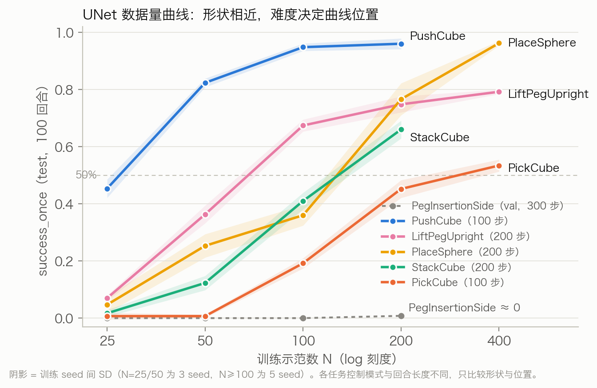
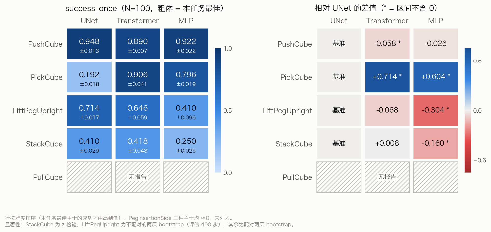
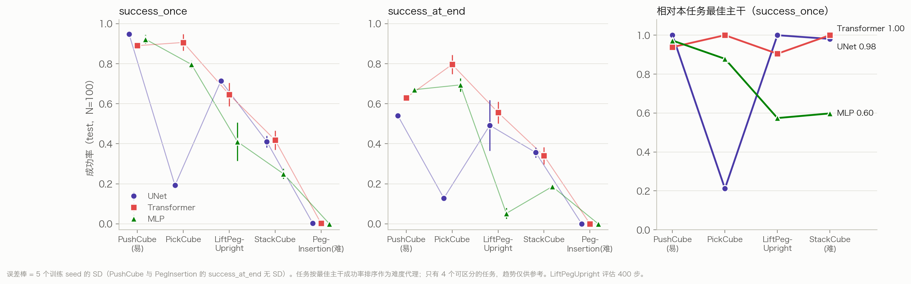

# 全组结果汇总（预处理稿）

更新：2026-10-05。来源：`results/task1.md`、`task2_data.md`、`task2_backbone.md`、`task3.md`、`task6.md`、`task6_backbone`（组员报告），
Task 5 取自本地 [experiment-progress](experiment-progress.zh-CN.md) §6、§9、§10、§12–§15 和 `results/takeover-correction/decision.json`。
共同口径：RGB Diffusion Policy，100k optimizer steps，`final.pt`，测试种子 10000–10099（100 回合），
主指标 `success_once`，表中为 seed 间均值 ± SD。

## 1. 任务映射与完成度

| 编号 | 原计划任务 | 实际任务 | 控制 / 动作维 | 评估步数 | 数据量（轨道 A） | 主干（轨道 B） | 拓展 |
| --- | --- | --- | --- | ---: | --- | --- | --- |
| Task 1 | PickCube | PickCube | ee_delta_pos / 4 | 100 | ✅ 25–400 | ✅ | — |
| Task 2 | StackCube | StackCube | ee_delta_pos / 4 | 200 | ✅ 25–200（400 未跑） | ✅ | — |
| Task 3 | PushCube | PushCube（推断，报告未写任务名） | ee_delta_pos / 4 | 100 | ✅ 25–200（400 按规则不触发） | ✅ | — |
| Task 4 | PullCube | — | — | — | ❌ 无报告 | ❌ | — |
| Task 5 | PegInsertionSide | PegInsertionSide → **PlaceSphere** | joint_pos / 8 → ee_delta_pos / 4 | 300 → 200 | Peg ≈0（负结果）；PlaceSphere ✅ 25–400 | Peg ≈0；PlaceSphere 未做 | ✅ failure-aware + 专家接管纠正（PlaceSphere） |
| Task 6 | PlugCharger | **LiftPegUpright** | joint_pos / 8 | 200（数据量）/ 400（主干） | ✅ 25–400 | ✅ | — |

## 2. 数据量（UNet，`success_once`）

| 任务 | N=25 | N=50 | N=100 | N=200 | N=400 | 100→200 是否显著 |
| --- | --- | --- | --- | --- | --- | --- |
| PickCube | 0.007 ± 0.012 | 0.007 ± 0.006 | 0.192 ± 0.018 | 0.452 ± 0.031 | 0.534 ± 0.021 | 是，+0.260 [+0.198, +0.322] |
| StackCube | 0.017 ± 0.012 | 0.123 ± 0.025 | 0.410 ± 0.029 | 0.660 ± 0.031 | 未跑 | 是，+0.250 [+0.182, +0.318] |
| PushCube | 0.45 | 0.82 | 0.95 | 0.96 | 不触发 | 否，+0.012 [−0.014, +0.038] |
| PlaceSphere | 0.047 ± 0.029 | 0.253 ± 0.041 | 0.360 ± 0.036 | 0.766 ± 0.056 | 0.962 ± 0.008 | 未计算（点估计 +0.406） |
| LiftPegUpright | 0.070 ± 0.010 | 0.363 ± 0.031 | 0.674 ± 0.021 | 0.748 ± 0.028 | 0.792 ± 0.008 | 未报告 |
| PegInsertionSide | 0（val） | 0（val） | 0（val） | 0.008（val） | — | — |

N=25/50 为 3 个训练 seed，N≥100 为 5 个。PegInsertionSide 这一行用的是 val 50 回合，与其他行口径不同。

形状上分三类：PushCube 在 100 条饱和；PickCube、LiftPegUpright、PlaceSphere 到 400 条仍在涨但收益递减（PlaceSphere 400 条时 0.962，接近饱和）；
StackCube 到 200 条仍然陡升，按预注册规则（100→200 区间不含 0 就加 400）本应补 N=400，目前是唯一没补的。

## 3. 主干对比（N=100，`success_once`）

| 任务 | UNet | Transformer | MLP | 排序 |
| --- | --- | --- | --- | --- |
| PickCube | 0.192 ± 0.018 | **0.906 ± 0.041** | 0.796 ± 0.019 | T > M ≫ U |
| LiftPegUpright（评估 400 步） | **0.714 ± 0.017** | 0.646 ± 0.059 | 0.410 ± 0.096 | U ≥ T ≫ M |
| StackCube | 0.410 ± 0.029 | 0.418 ± 0.048 | 0.250 ± 0.025 | U ≈ T > M |
| PushCube | **0.95** | 0.89 | 0.92 | U ≥ M > T（T−U = −0.058，显著） |
| PegInsertionSide | 0.002 | 0.002 | 0.000 | 全部 ≈0 |

四个可评估任务上排序各不相同，没有一种主干在所有任务上最好。PickCube、StackCube、PushCube 的 UNet 和第 2 节的 N=100 一致（0.192 / 0.410 / 0.95），说明两条轨道共用了同一批 run。
LiftPegUpright 对不上：主干报告里 UNet 是 0.714（评估 400 步），数据量报告里 N=100 是 0.674（评估 200 步），需要确认是不是同一批 run。

LiftPegUpright 的显著性是我用 seed 级数值算的不配对两层 bootstrap（组员报告没有做检验）：T−U = −0.068 [−0.142, +0.008]，不显著；M−U = −0.304 [−0.402, −0.212]，显著。

`success_at_end` 和 `success_once` 的排序可能相反。PushCube 上 MLP 0.67 > T 0.63 > U 0.54，UNet 进目标区最多，滑出来也最多。
LiftPegUpright 上 T 0.556 > U 0.492 > M 0.052：MLP 有 41% 的回合把 peg 立起来过，但几乎都没能保持到结束。

## 4. 拓展：failure-aware 引导（PlaceSphere，N=100，3 个 checkpoint × 100 回合）

| 组 | B 基线 | F 失败引导 | A 自适应 | C1 成功引导 | C2 自模仿 |
| --- | --- | --- | --- | --- | --- |
| `success_once` | 0.363 | 0.380 | 0.377 | 0.367 | 0.360 |

H1（F vs B）+1.7 pp，区间 [−2.0, +5.0]，H2、H3 也都不可区分，属于中性结果。引导让推理耗时翻倍（约 1.0 s，基线约 0.5 s）。
第二轮（K_fail 150/300，新 seed 128 回合）B / F150 / F300 = 35 / 33 / 35，没有达到推进门槛。
专家接管 probe：接管本身可行（9/9 放置成功），但约 90% 的失败发生在抓取阶段，持球后接管只能覆盖约 9% 的失败。

**专家接管纠正训练（v2，接管点前移到抓取落空）**：新种子 43000–43199，每个 checkpoint 每组 200 回合，共 600 回合。

| 组 | B 基线 | C（+纠正片段微调） | D（+等量普通示范微调） |
| --- | ---: | ---: | ---: |
| 成功数 / 600 | 197（32.8%） | **280（46.7%）** | 194（32.3%） |

C−B **+13.8pp** [+9.3, +18.3]，C−D **+14.3pp** [+9.5, +19.0]，D−B −0.5pp [−4.7, +3.5]。三个 checkpoint 方向一致、各自显著。
这是 Task 5 拓展部分唯一的正结果。局限：机制验证（C 的抓取落空是否真的减少）还没跑；D 没有提升而从零训练加示范涨得很多，说明 D 的零提升可能来自微调设置，纠正数据的优势应理解为「在这套微调设置下更有效」。

## 5. 缺失信息清单

**必须补（否则表格不完整）**

1. **Task 4 PullCube 整体缺失**，需要确认是没跑还是报告没交。
2. **Task 3** 报告里没有写任务名，需要确认是 PushCube。数据量表也缺 seed 间 SD 和 val loss。
3. **Task 6 LiftPegUpright**：
   - **评估步数不统一**：数据量评估用 200 步，主干评估用 400 步，checkpoint 里记录的是 50 步。训练示范长度 153–702 步（中位 169），200 步会截掉一部分长回合，400 步也盖不住最长的 702 步。建议全部统一重评为 400 步（只需评估，不用重训，每个 run 约 3–4 GPU-min）。
   - 数据量部分缺每个 seed 的数值、各 N 的 `success_at_end`（只有 N=400 的 0.784）、相邻档 bootstrap、val loss 数值、算力和 Gate B。
   - 主干部分需要确认测试种子是不是 10000–10099（报告只写了「checkpoint 配置中的 test seed 序列」），以及运行时代码是 dirty 状态时具体改了什么。
4. **Task 2 StackCube**：主干报告缺参数量、训练和推理耗时，统计检验用的是 z 检验，没有用两层 bootstrap。数据量报告里还有若干【待补】，比如示范来源和 batch/lr（这两项其实全组统一，可以直接引用 Task 1 / Task 3 的设置）。N=400 已满足触发条件但没跑。
5. **Task 5 PlaceSphere 数据量**：缺 `success_at_end`、相邻档 bootstrap 和 val loss；没有做主干对比。N=400 已补（0.962）。

**口径不一致（汇总前要统一）**

- **参数量**：Task 1 只统计主干（66.4M / 8.97M / 0.353M），Task 3 统计全模型（80.8M / 20.2M / 11.7M）。
- **训练耗时**受节点影响：StackCube 单 run 约 4.5 h，PickCube 约 1.7 h，不能跨任务比较。
- **统计方法**：Task 1/2-data/3/5 用两层 bootstrap，Task 2-backbone 用 z 检验，Task 6 没有做检验（主干部分我按 seed 级数值补算了不配对的 bootstrap）。
- **推理耗时**：MLP 在 LiftPegUpright 上是 150 ms，在 PickCube 上是 97 ms，动作维度和节点都不同，不能跨任务比较。
- **`success_at_end`** 各任务报得不全，至少要补齐 N=100 这一档。

## 6. 展示建议：跨任务和分任务都要有

两条主线（数据量、主干）的协议在全组是统一的：相同的 N 网格、相同的 100k 步和测试种子、相同的指标。分任务介绍会把以下两个结论拆散，而这两个结论只有并排看才能看出来：

- **数据需求高度依赖任务**：PushCube 用 100 条就饱和，StackCube 和 PlaceSphere 到 200 条还在陡升，PegInsertionSide 始终为 0。
- **主干没有通用最优**：Transformer 在 PickCube 上最好，在 PushCube 上最差；MLP 在 PickCube 上第二，在 StackCube 和 LiftPegUpright 上最差。

建议的结构：

1. **跨任务主图**：5 条 success–N 曲线放在一张图里（PegInsertionSide 作为 0 线），再加一张「任务 × 主干」热力表。只比较形状和排序，**不比较绝对值、不做跨任务平均**，因为各任务的控制模式、回合长度和相机设置都不同。
2. **分任务 deep dive**：每个任务只讲它独有的发现。PickCube：UNet 过拟合，val loss 从 10k 步起上升。PushCube：成功后又滑出。StackCube：val loss 比成功率更稳定。PegInsertionSide：负结果，失败集中在对准孔的阶段。
3. **Failure-aware 单独成节**：它只在 PlaceSphere 上做过，与跨任务比较无关。

## 7. 跨任务图与难度分析

图由 [scripts/plot_cross_task.py](../scripts/plot_cross_task.py) 生成，数字从各组报告转录：

```bash
python3 scripts/plot_cross_task.py
```







### 7.1 怎么定义难度

用「本任务最佳主干在 N=100 的成功率」作为难度代理：
PushCube 0.95 > PickCube 0.906 > LiftPegUpright 0.714 > StackCube 0.418 > PegInsertionSide ≈0。
前后两端和任务阶段数一致：推 → 抓+抬 → 抓+抬+放到方块上 → 精密插入。LiftPegUpright 落在中间，但它的评估是 400 步、用关节控制，和其他任务的设置不同，位置只能作参考。

不用 UNet 的成绩定义难度。按 UNet 的数据量曲线，PickCube 达到 50% 需要约 300 条，比 StackCube（约 128 条）还难，
这显然不符合任务本身（StackCube 包含 PickCube）。用 UNet 来衡量难度，会被 UNet 在 PickCube 上的过拟合带偏。

### 7.2 数据量：难度决定曲线的位置，曲线形状相近

| 任务 | 达到 50% 所需示范数（log 插值） | N=200 时的状态 |
| --- | ---: | --- |
| PushCube | ≈27 | 已饱和 |
| LiftPegUpright | ≈68 | 收益递减 |
| PlaceSphere | ≈127 | 仍在陡升；400 条时 0.962，接近饱和 |
| StackCube | ≈128 | 仍在陡升 |
| PickCube（UNet） | ≈300 | 收益递减（受 UNet 过拟合影响） |
| PegInsertionSide | 未达到 | ≈0 |

在 log N 坐标下，几条曲线大致都是 S 形，只是左右平移。「100 条够用」这个说法只对简单任务成立；
StackCube 和 PlaceSphere 在 200 条时还处于最陡的一段。PlaceSphere 已补 N=400，确认是再涨一段后接近饱和；StackCube 的 N=400 仍缺。

### 7.3 主干：加入 LiftPegUpright 后，MLP 的趋势更清楚，Transformer 的趋势变弱

| 主干 | 相对本任务最佳（Push → Pick → Lift → Stack） | 判读 |
| --- | --- | --- |
| MLP | 0.97 → 0.88 → 0.57 → 0.60 | **任务越难，落后越多**。在 LiftPegUpright（−0.304）和 StackCube（−0.160）上都显著最差。新任务证实了这个趋势 |
| Transformer | 0.94 → 1.00 → 0.90 → 1.00 | 在所有任务上都在最佳的 90% 以内，最稳定。但 LiftPegUpright 上落后 UNet（−0.068，不显著），所以「难任务上相对更好」这一说法不再成立 |
| UNet | 1.00 → 0.21 → 1.00 → 0.98 | 4 个任务里有 3 个是最佳或并列最佳。PickCube 是唯一的例外（过拟合），和难度无关 |

可以写进报告的说法：
- **MLP 在较难、较长的任务上明显掉队**，这是 4 个任务里最一致的信号。
- **Transformer 从不垫底**，在所有任务上都接近最佳。
- **UNet 多数时候最好**，但可能在单个任务上因过拟合而失效。

仍应写成「4 个任务上的观察」，不能写成规律。

MLP 的落后同时和难度、回合长度相关，两者分不开。它表现好的两个任务（PushCube、PickCube）评估都是 100 步，
落后的两个任务（LiftPegUpright 示范中位长度 169 步，StackCube 评估 200 步）都更长。
一个可能的解释（属于假设）：MLP 主干参数最少、没有时序结构，长程、多阶段任务需要更强的时序建模。

### 7.4 success_at_end：Transformer 最能「守住」成功

| 任务 | UNet | Transformer | MLP | 排序 |
| --- | ---: | ---: | ---: | --- |
| PushCube | 0.54 | 0.63 | 0.67 | M > T > U |
| PickCube | 0.128 | 0.796 | 0.694 | T > M > U |
| LiftPegUpright | 0.492 | 0.556 | 0.052 | T > U > M |
| StackCube | 0.356 | 0.340 | 0.186 | U ≈ T > M |

按 `success_at_end` 排，Transformer 在 4 个任务上的名次是 2、1、1、2，从不垫底；UNet 和 MLP 都各有垫底的任务。
回合内掉成功的情况和任务本身有关：PushCube 是方块推进目标区后滑出去，LiftPegUpright 上 MLP 是把 peg 立起来后又倒了（once 0.41 → end 0.05）。
LiftPegUpright 上 T 和 U 的 at_end 差值 +0.064 [−0.060, +0.186] 不显著，UNet 在这一项上的 seed 间波动很大（0.33–0.66）。

### 7.5 要把这个趋势做实，还缺什么

1. **统一 LiftPegUpright 的评估步数**：数据量和主干两部分分别用 200 步和 400 步评估，统一之前不能把两张表直接拼起来。
2. **PullCube 的主干对比**：难度应和 PushCube 相近，可以检验「Transformer 在简单任务上略落后」是否可重复。
3. **PlaceSphere 的主干对比**：中等难度、200 步，可以帮助区分 MLP 的落后到底来自难度还是回合长度。10 个 run，
   按单 run 约 1.7 h 估算，约需 17–18 GPU-h 加评估时间。
4. **PickCube 上 UNet 过拟合的原因**：StackCube、LiftPegUpright 上 UNet 同样把训练集拟合到 loss≈0（LiftPegUpright 上是 0.0002），却都没有崩掉。
